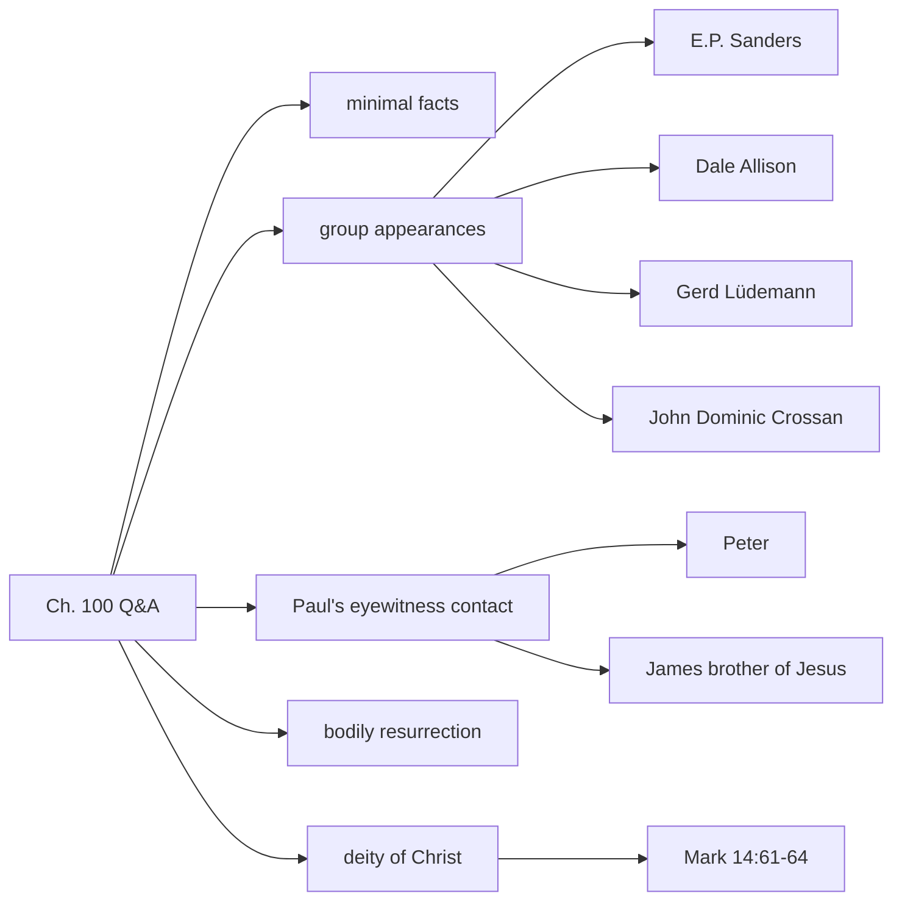

# Chapter 100 — Q & A with Gary Habermas & Mike Licona

**Channel:** [[Gary Habermas]] · **Speakers:** [[Gary Habermas]], [[Mike Licona]] · **Date:** 2026-09-23 · [Watch on YouTube](https://www.youtube.com/watch?v=4IdrJ74e5sE)

---

> [!summary]- Summary
> Mike Licona hosts Gary Habermas for a live Q&A about the resurrection. The core exchange defends group appearances as a Habermas minimal fact: the earliest Creed lists three group sightings, and critical scholars such as E.P. Sanders, Dale Allison, Gerd Lüdemann, and John Dominic Crossan grant that groups had experiences they interpreted as seeing the risen Jesus. They also discuss the criteria for a minimal fact, the empty tomb, Paul's early eyewitness contacts, the bodily resurrection, and the strongest texts for Jesus's self-understanding.

> [!list]- Key claims
> 1. The empty tomb is **not** one of Habermas's six minimal facts, though he thinks it is well evidenced.
> 2. The majority of resurrection appearances in the earliest sources are to **groups**, not individuals.
> 3. A minimal fact requires enough data to be called historical **and** broad scholarly agreement.
> 4. Paul interviewed Peter and James in Jerusalem around **35–36 AD**.
> 5. Paul believed in a **bodily, physical** resurrection of Jesus.
> 6. **Mark 14:61–64** is a stronger text for Jesus's claim to deity than John 8:58.

---

## What this is

A friendly, wide-ranging live Q&A between two resurrection scholars. Habermas answers audience questions while Licona presses for clarity on definitions, scholarly percentages, and the difference between data and interpretation. The tone is conversational but dense with names, texts, and methodological commitments.

---

## What it means

Habermas's minimal-facts approach tries to keep the evidential foundation small enough that critics grant the facts, then argue that the resurrection is the best explanation of those facts. The most contested move in this session is whether **group appearances** meet that standard. Habermas says yes because:

- The 1 Corinthians 15 Creed lists the Twelve, the more-than-five-hundred, and all the apostles — three group appearances against two individual ones.
- The Acts sermon summaries preserve early apostolic proclamation.
- Even skeptical scholars grant the underlying experience, even if they explain it differently.

Licona adds that "vast majority" is deliberately not a percentage; Habermas means "far above 50.1%" and allows the percentage to vary by fact.

---

## How it connects

### Inside this channel
- Closest videos: [[Gary Habermas - Chapter 095 - MANY GROUP APPEARANCES PROVIDE CONFIRMATION for the RESURRECTION - Gary Habermas & Mike Licona|Ch. 095]], [[Gary Habermas - Chapter 073 - The Resurrection Isn't Explained By Hallucinations – Gary Habermas|Ch. 073]], [[Gary Habermas - Chapter 216 - Gary Habermas's Summary of the Minimal Facts|Ch. 216]]
- Habermas mentions his four-volume work *On the Resurrection*; volumes one and two are out at the time of recording.

### To the vault
- Supports the axiom/claim that group testimony to the resurrection is early and multiply attested.
- Provides scholar-position data for [[E.P. Sanders]], [[Dale Allison]], [[Gerd Lüdemann]], [[John Dominic Crossan]].
- Cites [[1 Corinthians 15]], [[Galatians 1]], [[Mark 14]].

### Tensions
- Licona and Habermas disagree on the Chicago Statement on inerrancy; this is noted but not central to the video.
- Licona thinks the 1 Cor 15 Creed is ambiguous on bodily details; Habermas uses it as part of the broader case.

---

## Christian lens

- **Scripture used:** 1 Cor 15:3–7 (early creed), Gal 1:18–2:10 (Paul's eyewitness contact), Mark 14:61–64 (Jesus before the Sanhedrin), John 8:58, Phil 3:21, Rom 8:11, 1 Thess 4:13–17.
- **Doctrine touched:** resurrection of Jesus, bodily resurrection, deity of Christ, apostolic testimony, inerrancy.
- **Apologetic argument type:** historical / evidential.
- **Strength:** names specific skeptical scholars who grant group experiences; ties facts to very early sources.
- **Weak points a skeptic would press:** "vast majority" is not quantified; group experiences do not by themselves prove a physical resurrection.
- **Theophysics bridge:** the early creedal data (HISTORICAL) supports claims about resurrection and identity; the deity discussion (THEOLOGICAL) connects to Logos-field / observer axioms by analogy.

---

## Mini graph

---

## Open threads

- [ ] What exact percentage of critical scholars grant group appearances? Habermas refuses a number; can it be estimated from a literature survey?
- [ ] How does Crossan's "altered states of consciousness" view differ from a plain hallucination theory?
- [ ] Does the 1 Cor 15 Creed itself teach bodily resurrection, or is that Paul's later interpretive frame?
- [ ] Which chapters in this channel give the full list of Habermas's six minimal facts?

---

## Transcript

See source file:
`D:/GitHub/Research-Acquisition/yt-bulk-subtitles-downloader/subtitles/Gary Habermas/Gary Habermas - Chapter 100 - Q & A with Gary Habermas & Mike Licona.md`

> [!quote]- Raw transcript
> _Raw transcript is preserved in the source file. The cleaned paragraphs and extracted atoms live above._
